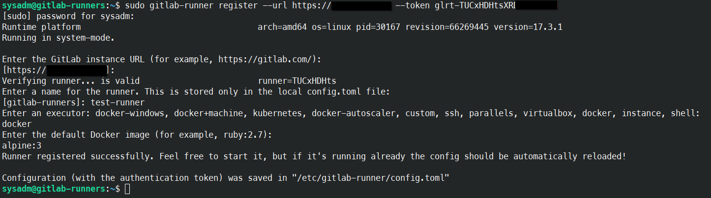
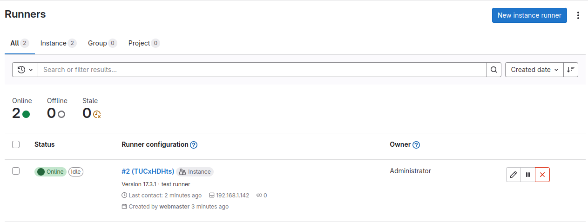
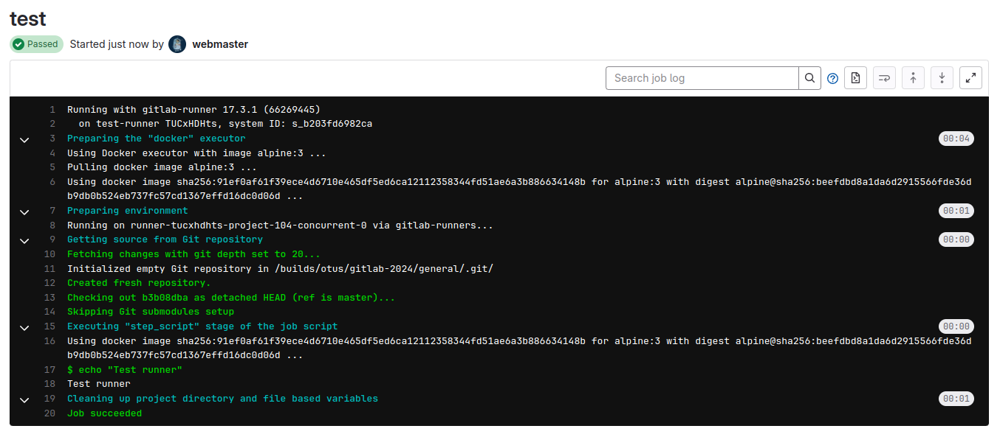

Для создания раннера будем использовать отдельную виртуальную машину и подключать его к уже существующему инстансу GitLab.



После создания был создан конфигурационный файл:

```
[[runners]]
  name = "test-runner"
  url = "https://*******.ru"
  id = 2
  token = "glrt-TUCxHDHtsXRDG******"
  token_obtained_at = 2024-10-09T12:59:02Z
  token_expires_at = 0001-01-01T00:00:00Z
  executor = "docker"
  [runners.custom_build_dir]
  [runners.cache]
    MaxUploadedArchiveSize = 0
    [runners.cache.s3]
    [runners.cache.gcs]
    [runners.cache.azure]
  [runners.docker]
    tls_verify = false
    image = "alpine:3"
    privileged = false
    disable_entrypoint_overwrite = false
    oom_kill_disable = false
    disable_cache = false
    volumes = ["/cache"]
    shm_size = 0
    network_mtu = 0
```

и раннер стал доступен для сборки проектов в GitLab:



Проверим его работу, выполнив простой конвейер:

```
stages:
  - test

test:
  stage: test
  script:
    - echo "Test runner"
```


