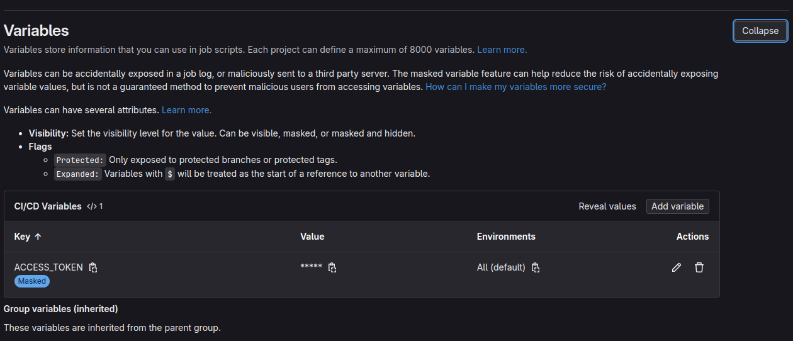
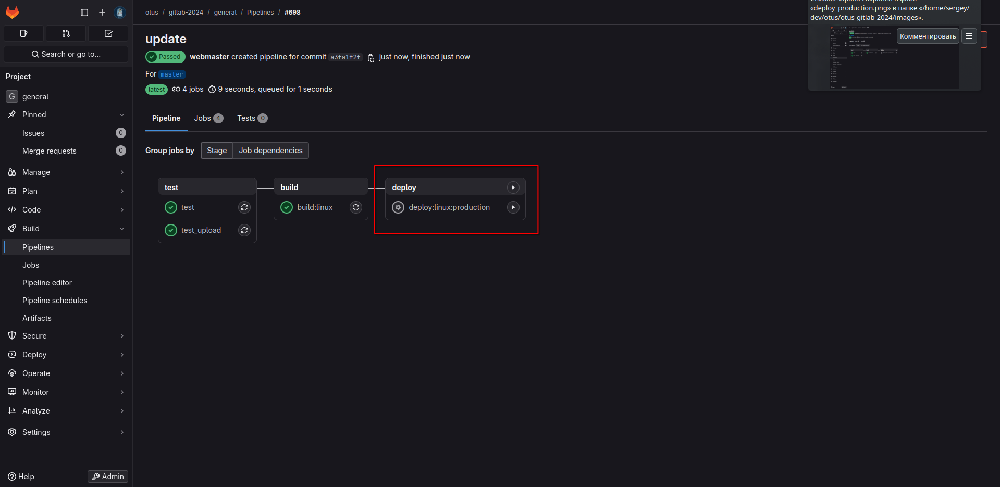
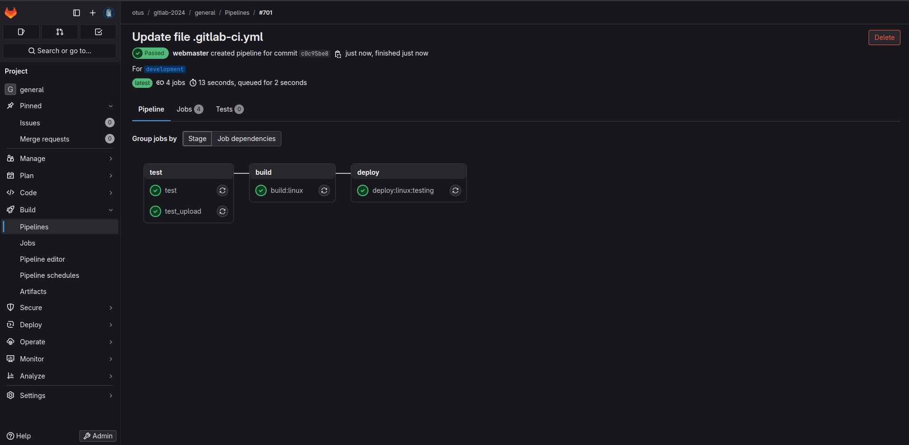

Напишем простой конвейер:

```yaml
variables:
  BUILD_IMAGE: golang:1.23 # Имя образа, на котором будет собираться приложение

stages:
  - test
  - build
  - deploy

test:
  stage: test
  before_script:
    - echo Create data
  script:
    - echo Run tests
  after_script:
    - echo Clear data

test_upload:
  stage: test
  needs: ["test"]
  script:
    - ./upload.sh

build:linux:
  image: $BUILD_IMAGE
  stage: build
  needs: ["test"]
  script:
    - echo Run build for Linux with tag $CI_PIPELINE_ID # Тегом образа будет идентификатор конвейера
  after_script:
    - echo clear data

# Развертывание приложения в боевом окружении
deploy:linux:production:
  stage: deploy
  needs: ["build:linux"]
  script:
    - echo Login to production polygon with access token $ACCESS_TOKEN # Переменная ACCESS_TOKEN определена на уровне проекта
    - echo Deploy to production
  rules:
    - if: $CI_COMMIT_BRANCH == 'master'
  when: manual  

# Развертывание приложения в тестовом окружении
deploy:linux:testing:
  stage: deploy
  needs: ["build:linux"]
  script:
    - echo Deploy to testing
  rules:
    - if: $CI_COMMIT_BRANCH == 'development'
```

Скрипт, который запускается в задаче test_upload:

```bash
echo Upload test result
```

Переменные проекта:



Результат выполнения конвейера для production-окружения. Запуск задачи непосредственно развертывания сделал ручным намеренно.




При запуске для ветки development развертывание выполняется автоматически:


